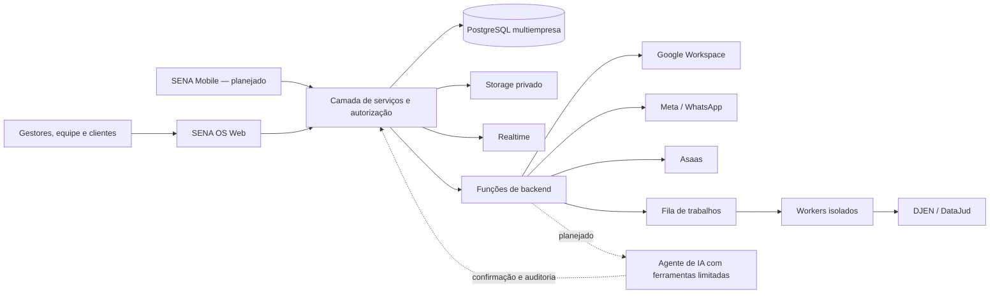

<p align="center">
  
</p>

<h1 align="center">Grupo SENA</h1>

<p align="center">
  <strong>Inteligência operacional para conectar atendimento, gestão, execução e resultado.</strong>
</p>

<p align="center">
  Portfólio institucional · Produtos digitais · Integrações · IA aplicada à operação
</p>

> **Nota de transparência:** este repositório apresenta o portfólio e a direção de produto do Grupo SENA. Funcionalidades são classificadas como **disponíveis**, **em validação** ou **planejadas**. Roadmap não representa promessa contratual de prazo ou entrega.

## Visão geral

O **Grupo SENA** desenvolve soluções de gestão e tecnologia para empresas que precisam transformar informações dispersas em uma operação coordenada. O principal produto, o **SENA OS**, organiza a jornada que começa no atendimento e segue por cliente, oportunidade, agenda, tarefa, documento, execução, financeiro e histórico.

A proposta não é apenas digitalizar telas. É criar uma linha operacional contínua entre o que foi solicitado, vendido, agendado, executado, documentado e cobrado — com rastreabilidade por empresa, usuário e cliente.

## Proposta de valor

Empresas de serviços costumam crescer apoiadas em WhatsApp, planilhas, agenda, arquivos e conhecimento informal da equipe. Com o aumento do volume, o dono ou gestor vira o ponto de ligação entre sistemas e pessoas.

O Grupo SENA atua para:

- centralizar a operação sem apagar as ferramentas que a empresa já utiliza;
- converter conversas em registros e próximas ações;
- conectar escritório, equipe de campo e gestão;
- reduzir retrabalho, perda de informação e atraso entre execução e cobrança;
- oferecer visão gerencial com isolamento de dados por organização;
- introduzir automação e IA de forma supervisionada, auditável e economicamente controlada.

## Portfólio

| Produto ou frente | Papel no ecossistema | Maturidade |
|---|---|---|
| **SENA OS** | Núcleo operacional multiempresa para atendimento, CRM, clientes, agenda, tarefas, serviços, equipe e gestão | Disponível / evolução contínua |
| **SENA Legal** | Vertical jurídica para processos, equipe jurídica, OABs monitoradas, publicações e tarefas | Piloto funcional / validação controlada |
| **SENA Serviços** | Jornada de orçamento, aprovação, agendamento, ordem de serviço, conclusão e cobrança | Base funcional / expansão planejada |
| **SENA AI** | Interface de inteligência contextual para resumos, prioridades e assistência à decisão | Experiência inicial / integração real planejada |
| **SENA Autopilot** | Agente operacional progressivo, com ferramentas limitadas, orçamento de uso e confirmação humana por risco | Planejado |
| **SENA Mobile** | Experiência PWA para execução em campo, evidências, checklists e baixa de atividades | Planejado |
| **SENA Service Tag / SENA TAP** | QR/NFC ligado ao histórico de ativos, recorrência de manutenção, avaliações e novos chamados | Conceito de produto |

Veja o detalhamento em [Portfólio e produtos](docs/PORTFOLIO.md) e a classificação objetiva em [Status do produto](docs/STATUS.md).

## SENA OS

O SENA OS é o núcleo compartilhado entre diferentes segmentos. A arquitetura multiempresa permite que cada organização utilize módulos, permissões, identidade e integrações próprias sem misturar dados.

### Módulos atuais

| Área | Capacidades principais |
|---|---|
| **Dashboard operacional** | Indicadores, pendências, agenda, visão de oportunidades e atalhos para a operação |
| **Financeiro** | Estrutura de dashboard, contratos e indicadores; evolução ligada a fontes financeiras reais |
| **Atendimento** | Central de conversas, mídia, contatos, grupos, encaminhamento, responsável e ações relacionadas |
| **Pipeline e CRM** | Leads, estágios comerciais, responsáveis, valores e acompanhamento de oportunidades |
| **Agenda** | Compromissos internos, clientes, responsáveis e sincronização com Google Agenda |
| **Clientes e onboarding** | Ficha central do cliente, dados, conversas, documentos, tarefas e histórico relacionado |
| **Tarefas** | Fila operacional, prioridade, prazos, responsáveis e vínculos com outros registros |
| **Orçamentos** | Propostas, itens, valores, status, aprovação e origem no atendimento |
| **Ordens de serviço** | Execução vinculada a cliente, conversa, tarefa, agenda ou orçamento aprovado |
| **Equipe e acessos** | Convites, solicitações de acesso, papéis, departamentos, permissões e ciclo de vida |
| **Service Blueprints** | Modelos reutilizáveis de serviço, documentos, qualificação, etapas e responsáveis |
| **Configuração e identidade** | Marca por organização, módulos, integrações, permissões e administração multiempresa |
| **Privacidade e auditoria** | Solicitações de titulares, trilha de ações, retenção e controles administrativos |

O fluxo comum pode ser resumido assim:

```text
Atendimento → Cliente → Oportunidade/Orçamento → Agenda/Tarefa
            → Execução/OS → Documento/Evidência → Financeiro → Histórico
```

## SENA Legal

O **SENA Legal** aplica o núcleo do SENA OS à rotina jurídica sem transformar o produto em um sistema de peticionamento. O foco do piloto é controle operacional:

- cadastro e acompanhamento de processos;
- vínculo entre processo, cliente e organização;
- equipe jurídica, múltiplos advogados e advogado principal;
- cadastro e monitoramento de OAB por UF;
- ingestão e tratamento de publicações do DJEN;
- consulta auxiliar de capa e movimentações públicas via DataJud;
- deduplicação, checkpoints, filas e tentativas controladas;
- criação de tarefas a partir de eventos jurídicos;
- histórico e status de tratamento de publicações;
- separação de processos sigilosos para rotina manual.

### Limites deliberados do piloto

- não há peticionamento automático;
- credenciais de PJe, Gov.br, certificados e chaves privadas não são armazenadas;
- processos sigilosos não são buscados por meios públicos inadequados;
- prazo processual não é calculado autonomamente;
- fontes públicas do CNJ são auxiliares e estão sujeitas a disponibilidade, cobertura e regras de uso.

## Integrações

| Integração | Uso no ecossistema | Situação |
|---|---|---|
| **Supabase** | PostgreSQL, autenticação, RLS, Storage, Realtime, Edge Functions e cofre de segredos | Base técnica atual |
| **Google Drive** | Pastas e arquivos por organização/cliente | Integração funcional |
| **Google Agenda** | Eventos e sincronização de compromissos | Integração funcional |
| **Gmail, Docs, Planilhas, Forms, Meet e Keep** | Conectores apresentados por ferramenta e autorização progressiva | Base de integração / expansão por fluxo |
| **WhatsApp Cloud API** | Canal oficial Meta, webhooks e atendimento | Implementado em base; ativação depende de configuração/aprovação externa |
| **WhatsApp Standard** | Dispositivo vinculado por QR e suporte a grupos/conversas | Alternativa experimental, não oficial e com risco operacional explícito |
| **Asaas** | Conexão financeira e verificação de clientes | Sandbox MVP |
| **DJEN / Comunica PJe** | Publicações jurídicas por OAB/UF | Piloto funcional |
| **DataJud** | Capa e movimentações públicas de processos | Uso auxiliar no piloto |
| **Cloudflare Turnstile e Resend** | Proteção contra abuso e e-mails operacionais | Infraestrutura de apoio |

## IA e SENA Autopilot

A IA do ecossistema é pensada em três níveis progressivos:

1. **Contexto:** resumos, briefing diário, pendências e perguntas sobre a operação.
2. **Copiloto supervisionado:** consulta ferramentas autorizadas, prepara respostas e rascunhos de ações; uma pessoa confirma antes da execução.
3. **Autopilot por política:** executa apenas ações previamente validadas, de baixo risco e dentro de limites técnicos e financeiros.

Princípios do Autopilot:

- nenhuma IA recebe acesso irrestrito ao banco;
- ferramentas são específicas, com escopo mínimo por organização;
- ações sensíveis exigem confirmação humana;
- cada execução registra organização, modelo, consumo, custo e resultado;
- há limites mensais por organização e limites de passos por tarefa;
- falhas, incerteza e tarefas complexas retornam para uma pessoa;
- o provedor de modelo pode evoluir sem alterar o núcleo de permissões.

O primeiro caso de uso planejado é o **agendamento supervisionado pelo Atendimento**: entender a intenção, consultar cliente/profissionais/disponibilidade, sugerir uma resposta e criar um pré-agendamento somente após confirmação.

## Público-alvo

### Prioridade comercial

- pequenas e médias empresas prestadoras de serviços;
- operações com aproximadamente 20 a 60 colaboradores;
- empresas com técnicos, instaladores, consultores ou equipes externas;
- negócios que recebem demanda pelo WhatsApp e controlam a execução em múltiplas ferramentas;
- gestores que precisam reduzir o intervalo entre serviço concluído, documentação e cobrança.

Exemplos: climatização, manutenção, instalação, assistência técnica, facilities, limpeza, serviços profissionais, consultorias e operações recorrentes de campo.

### Vertical de validação

Escritórios de advocacia e equipes jurídicas são o ambiente de validação do SENA Legal e de componentes do núcleo — cliente, documentos, tarefas, agenda, equipe, auditoria e integrações.

## Arquitetura geral



Detalhes em [Arquitetura](docs/ARCHITECTURE.md).

## Stack conhecida

### Aplicação

- React 19, TypeScript e React Router;
- Vite 6 e Tailwind CSS 4;
- Recharts, Lucide React e Motion;
- aplicação web responsiva, com PWA dedicada prevista no roadmap.

### Dados e backend

- Supabase com PostgreSQL, Auth, RLS, Storage, Realtime e Edge Functions;
- RPCs e comandos transacionais para fronteiras críticas;
- Node.js 22 e Express em serviços específicos;
- workers server-side para rotinas externas e processamento de filas.

### Operação

- Docker para serviços persistentes;
- GitHub Actions para build, testes, auditoria, deploy e recuperação;
- scanners de segredos, auditoria de dependências e backups cifrados;
- hospedagem e provedores externos desacoplados da apresentação institucional.

## Diferenciais

- **Operação de ponta a ponta:** conecta demanda, venda, agenda, execução, evidência e cobrança.
- **WhatsApp como entrada operacional:** a conversa pode originar cliente, oportunidade, tarefa, orçamento ou OS.
- **Núcleo comum com verticais:** a mesma base atende serviços e jurídico sem duplicar cadastros centrais.
- **Multiempresa por desenho:** isolamento por organização, módulos e permissões desde a camada de dados.
- **Integração progressiva:** a empresa preserva ferramentas conhecidas enquanto reduz fragmentação.
- **IA governada:** assistência primeiro, autonomia depois; sempre com limites, trilha e escalonamento humano.
- **Gestão + tecnologia:** implantação orientada ao processo real da empresa, não apenas entrega de software.

## Visão comercial

O SENA OS pode ser comercializado como plataforma modular acompanhada de implantação consultiva. A composição pode incluir:

- diagnóstico e desenho do fluxo operacional;
- configuração de organização, marca, módulos e permissões;
- integração com ferramentas autorizadas;
- implantação de Service Blueprints;
- migração assistida de dados compatíveis;
- treinamento, suporte e melhoria contínua;
- módulos verticais e automações conforme maturidade e risco.

Não há preços públicos definidos neste repositório. Escopo, limites, integrações, armazenamento, suporte e consumo de IA devem constar de proposta comercial específica.

Leia [Visão comercial](docs/COMMERCIAL.md).

## Roadmap resumido

```text
Fundação multiempresa e segurança
        ↓
Consolidação do SENA Core e pilotos reais
        ↓
SENA Legal + fluxo completo de Serviços
        ↓
Integrações oficiais e financeiro transacional
        ↓
SENA Mobile para execução em campo
        ↓
Agente de IA supervisionado
        ↓
Autopilot progressivo por política
        ↓
Produtos físicos conectados e novas verticais
```

O detalhamento e os critérios de passagem estão em [Roadmap](docs/ROADMAP.md).

## Segurança e privacidade

Este repositório não contém código-fonte do produto, dados de clientes, credenciais, identificadores internos de infraestrutura ou arquivos de ambiente.

Princípios públicos do projeto:

- segredos permanecem somente no servidor ou em cofres apropriados;
- chaves administrativas nunca são expostas no frontend;
- dados são isolados por organização e controlados por papéis/permissões;
- documentos de alto risco usam armazenamento privado e rastreabilidade;
- acesso de integrações deve ser mínimo, revogável e auditável;
- automações não devem publicar, peticionar ou decidir temas sensíveis sem revisão humana.

Consulte [Política de segurança](SECURITY.md).

## Estrutura deste repositório

```text
.
├── README.md
├── SECURITY.md
├── CONTRIBUTING.md
├── LICENSE.md
├── assets/
│   └── grupo-sena-mark.svg
└── docs/
    ├── ARCHITECTURE.md
    ├── COMMERCIAL.md
    ├── PORTFOLIO.md
    ├── ROADMAP.md
    └── STATUS.md
```

## Contato

Para conversas institucionais, parcerias e segurança: **contato@gruposena.com**.

---

<p align="center">
  <sub>© 2026 Grupo SENA. Todos os direitos reservados.</sub>
</p>
