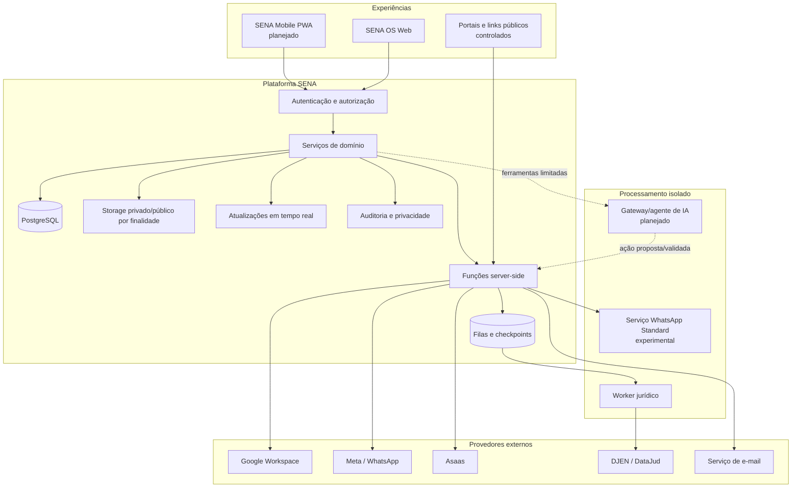
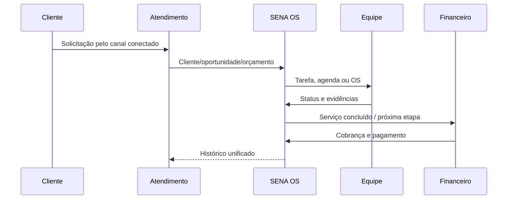
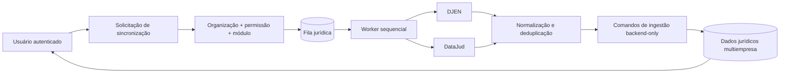
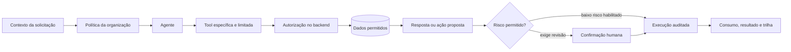

# Arquitetura geral

Este documento descreve a arquitetura em nível institucional. Ele não publica endereços internos, identificadores de projeto, credenciais, esquema completo de banco ou detalhes que aumentem desnecessariamente a superfície de ataque.

## Princípios

- **multiempresa:** cada registro operacional pertence a uma organização;
- **menor privilégio:** usuários, funções e integrações recebem apenas os acessos necessários;
- **backend para segredos:** chaves administrativas e tokens não são enviados ao navegador;
- **fronteiras transacionais:** operações críticas usam comandos/RPCs validados no servidor;
- **integrações desacopladas:** provedores externos não controlam o domínio central do produto;
- **idempotência:** ingestões e filas podem ser repetidas sem duplicar registros;
- **observabilidade com minimização:** eventos registram o necessário sem replicar conteúdo sensível;
- **humano no circuito:** decisões sensíveis e ações de alto risco permanecem supervisionadas.

## Visão de componentes



## Isolamento multiempresa

O contexto de organização atravessa os módulos operacionais. Em termos conceituais:

```text
Usuário autenticado
   → vínculo com organização
   → papel e departamento
   → módulos habilitados
   → permissão para a ação
   → política de acesso ao registro
```

O frontend pode ocultar uma função sem permissão, mas a decisão de segurança não depende apenas da interface. Políticas de banco e comandos de backend validam o contexto do usuário e da organização.

## Fluxo operacional de serviços



## Fluxo do SENA Legal



O navegador não consulta diretamente as fontes do CNJ e não recebe credenciais de backend. Processos sigilosos não são pesquisados como se fossem públicos.

## Fluxo planejado de IA



### Guardrails previstos

- orçamento mensal por organização;
- teto de chamadas, tokens e passos por execução;
- allowlist de ferramentas por caso de uso;
- validação de permissão no backend a cada ação;
- saída estruturada para ações, não comandos livres;
- confirmação humana conforme impacto;
- timeout, retry limitado e circuit breaker;
- registro de custo, resultado e razão de escalonamento;
- bloqueio independente da IA sem interromper funções normais do SENA OS.

## Stack

| Camada | Tecnologias conhecidas |
|---|---|
| Frontend | React, TypeScript, React Router, Vite, Tailwind CSS |
| UI e dados visuais | Lucide React, Motion, Recharts |
| Plataforma | Supabase Auth, PostgreSQL, RLS, Storage, Realtime, Edge Functions |
| Serviços | Node.js, Express, workers e filas |
| Integrações | Google Workspace, Meta/WhatsApp, Asaas, DJEN e DataJud |
| Operação | Docker, GitHub Actions, auditoria de dependências, varredura de segredos e backup cifrado |

## Segurança de configuração

- variáveis públicas são limitadas ao que realmente pode estar no cliente;
- credenciais de provedor ficam em variáveis do servidor ou cofre;
- chaves administrativas não usam prefixos destinados ao frontend;
- arquivos `.env` reais não pertencem ao versionamento;
- logs passam por minimização e redação de tokens;
- uploads são validados por tipo, extensão, tamanho e assinatura quando aplicável;
- workflows e dependências devem ser fixados e auditados.

## Limites deste documento

Diagramas são deliberadamente gerais. A topologia de produção, os contratos completos de dados, as políticas de recuperação e os runbooks operacionais permanecem na documentação privada do produto.
